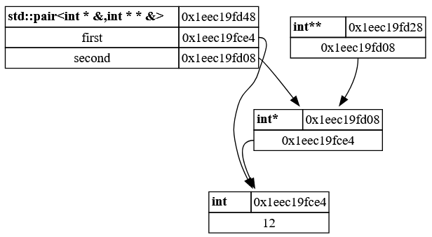

# cdv

C++ Data structure Visualization


[](https://app.codacy.com/gh/troopy28/cdv?utm_source=github.com&utm_medium=referral&utm_content=troopy28/cdv&utm_campaign=Badge_Grade)


## Introduction

Header-only C++ 17 library providing runtime data structure visualization capabilities, aimed at graphical debugging, visualization of complex hierarchies, and more. General-purpose graph drawing is also available through an intuitive API.

> [!CAUTION]
> **This library is currently in heavy development** and no API is entirely stable yet. Many features that are part of the library design goals are still missing and are being worked on.

## Design goals

There already are some C++ data structure visualization libraries out there. This one attempts to tick the following boxes:

- **Seamless standard library support**: printing a hierarchy of std containers, such as a `std::vector<std::vector<int*>>`, is a simple function call ([displaying containers of the standard library](#displaying-containers-of-the-standard-library)). 
- **Flexible**: the non-intrusive adapter-based approach of this library means no **modification of existing code is required** to visualize data structures. Custom classes can be visualized just by letting the library know about their members ([displaying a custom class](#displaying-a-custom-class)). This means you can also display classes from external libraries that you cannot modify! ([displaying external library classes](#Adapting-existing-classes-from-other-libraries)) 
- **Simple integration**: the library is header-only, and entirely fits in the `cdv.hpp` header file. Only depends on the standard library.

## Features and examples

Example :
```c++
cdv::visualization<std::string> visualization;

int some_int = 12;
visualization.add_data_structure(some_int); // Just add the integer !

int* some_int_pointer = &some_int;
visualization.add_data_structure(some_int_pointer); // Just add the pointer !

int** some_int_pointer_pointer = &some_int_pointer;
visualization.add_data_structure(some_int_pointer_pointer);

// Create a pair, referencing the two previous pointers.
const std::pair<int*&, int**&> my_pair{ some_int_pointer, some_int_pointer_pointer };
visualization.add_data_structure(my_pair);

// Export the visualization as a GraphViz string.
const std::string my_graphviz_text = cdv::generate_dot_visualization_string(visualization);
std::cout << my_graphviz_text << std::endl;
```

This outputs a string in [Graphviz](https://graphviz.org/)'s [Dot language](https://graphviz.org/doc/info/lang.html), which can be pasted in an online visualizer such as [this one](https://dreampuf.github.io/GraphvizOnline/), [this one](https://www.devtoolsdaily.com/graphviz/) or [this one](https://edotor.net/). It is also possible to directly use the `dot` executable provided by Graphviz if it is installed on your machine.

It results in the following image:



This little example showcases how displaying C++ data structures is always the same with CDV :
1. Create a `cdv::visualization`. It holds the graph representing the state of your data.
2. Add all the data structures to display with `add_data_structure`. CDV internally creates a graph of all the C++ data it is able to reach.
3. Export the visualization to a format suitable for display, by using `cdv::generate_dot_visualization_string`. This function exports the graph using [Graphviz](https://graphviz.org/)'s [Dot language](https://graphviz.org/doc/info/lang.html) 

It also demonstrates several key concepts of CDV:

- **CDV is recursive**. When an object's members can be reached by CDV, it dives inside and browses all the data inside of it, building the data graph. If you have objects **referencing each others**, CDV detects it. 
- No matter what you are trying to display, simply call `add_data_structure`. CDV resolves how to browse the data for the type given as a parameter: default type, std container, custom classes, etc.
- References and pointers are displayed as arrows. By default, references are shown using dashed arrows, and pointers using normal arrows.
- CDV handles a large number of std containers and utilities (here, `std::pair<T1, T2>`).

### Displaying containers of the standard library

The containers of the standard library are supported out of the box by the library. To display a container, simply do:
```c++
cdv::visualization<std::string> visualization;
std::vector<int> my_int_vec;
my_int_vec.reserve(10);
for (int i = 0; i < 10; ++i)
    my_int_vec.emplace_back(i);
visualization.add_data_structure(my_int_vec);
```

### Displaying a custom class

Custom classes are displayed by declaring their members to the library. This is done using three macros:  `CDV_DECLARE_MEMBER`, `CDV_DECLARE_PUBLIC_MEMBER` and `CDV_DECLARE_CUSTOM_MEMBER`. The following class is used as an example: 
```c++
class MyClass
{
public:
  const std::string& get_string() const
  {
    return my_string;
  }

  int get_int() const
  {
    return my_int;
  }

  double get_double() const
  {
    return my_double;
  }

  const char* MyPublicMember { "charptr member" };

private:
  std::string my_string{ "some text" };
  int my_int{ 24 };
  double my_double{ 3.14 };
};
```

#### Declaring a public member

To declare a public member (here `MyPublicMember`), simply use:
```c++
CDV_DECLARE_PUBLIC_MEMBER(MyClass, 0, MyPublicMember)
```
The first argument of the macro is always the type owning the member. The second argument is the index of the member. The third argument is the name of the public member. It must be publicly accessible.

> [!WARNING]  
> The member index must be unique per member of the class, or the code will not compile. Furthermore, when a class has several members, they must have consecutive indices. If an index is missing, all the members after the missing index will not be found by the library and therefore not displayed.

#### Declaring a member

Class members are usually private. If a member has a public getter, it is very easy to declare it using the `CDV_DECLARE_MEMBER` macro. For instance, to declare the members `my_string`, `my_int`, and `my_double`, the following lines are used:
```c++
CDV_DECLARE_MEMBER(MyClass, 1, "my_string", get_string())
CDV_DECLARE_MEMBER(MyClass, 2, "my_int", get_int())
CDV_DECLARE_MEMBER(MyClass, 3, "my_double", get_double())
```
The main difference with the previous macro is that the getter method providing access to the member is specified in the last argument:

- The first argument of the macro is, again, the type owning the member.
- The second argument is, again, the index of the member. 
- The third argument is the name *you want to use to display the value obtained through the getter method*. It differs from the previous macro, where it was directly the C++ name of the member.
- The last argument is the name of the getter method. It must be publicly accessible, and marked as `const`.

> [!NOTE]
> These macros allow you to simply declare members in one line and implement the template machinery to expose this member to the library. Refer to the section [Adapting a template class](#Adapting-a-template-class) for an explanation of the underlying system, in case these macros do not fit the needs of your specific classes.

#### Declaring a custom member

It is possible to declare custom members. Custom members can either be:
- Members for which there is **no accessible const getter for**. It can be useful when:
  - Declaring a member for an external class you cannot modify. See the [next section](#Adapting-existing-classes-from-other-libraries) for more details on this.
  - Declaring a member for a class on which the getter is not marked as `const`.
- **Fake members**. These are members that do not exist in the class, but that you want to display as a member in the graph generated by the library. This can be useful to display additional information about a given instance, such as whether class invariants are verified, for example.

The following example will show how to declare a fake member for the example class `MyClass` described above. We want to display a boolean that will be true to indicate that the string and the integer value represent the same number. This can be done as such:

```c++
TODO TODO TODO TODO TODO TODO TODO TODO TODO TODO TODO TODO TODO TODO 
TODO TODO TODO TODO TODO TODO TODO TODO TODO TODO TODO TODO TODO TODO 
TODO TODO TODO TODO TODO TODO TODO TODO TODO TODO TODO TODO TODO TODO 
TODO TODO TODO TODO TODO TODO TODO TODO TODO TODO TODO TODO TODO TODO 
TODO TODO TODO TODO TODO TODO TODO TODO TODO TODO TODO TODO TODO TODO 
TODO TODO TODO TODO TODO TODO TODO TODO TODO TODO TODO TODO TODO TODO 
```

> [!CAUTION]
> When using this member declaration method to work around a getter not being marked as `const`, make sure that the member does not modify the instance's content (that is: it really *should* be marked as `const`, but you cannot change it for reasons). If the getter modifies the displayed instance's internal state, then using this library as a debugging tool is meaningless and absurd, since it will display potentially incorrect data and alter the state of your program. 

### Adapting existing classes from other libraries

### Adapting a template class

Template classes require a little more work to adapt, because no macros are provided by the library to do the dirty work: you must define the adapting structures manually.

This example shows how to adapt the **template class** `std::pair<T1, T2>`, meaning the adapter will work with any `T1` and `T2`. Note that this is directly how the library adapts `std::pair<T1, T2>`, the code can be found in the library's source code.


### Fully custom graphs

## Supported compilers

## CMake integration

## License

## Contact

## Notes
